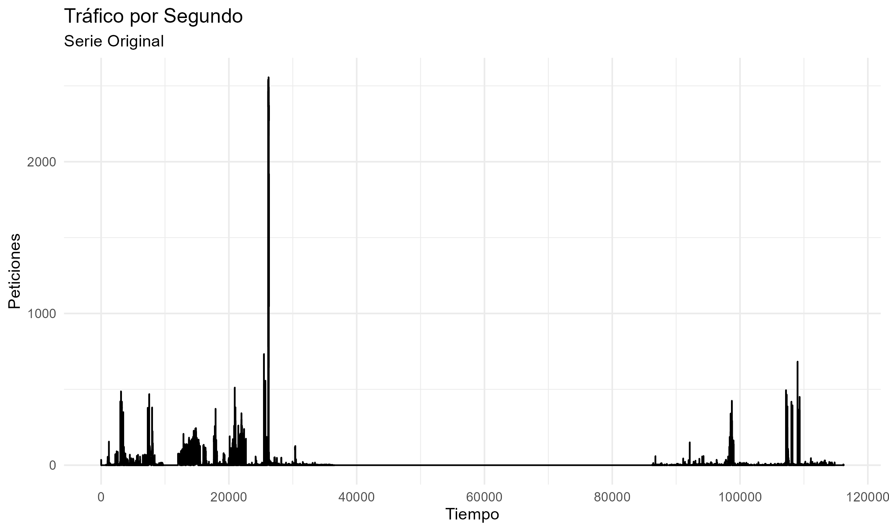
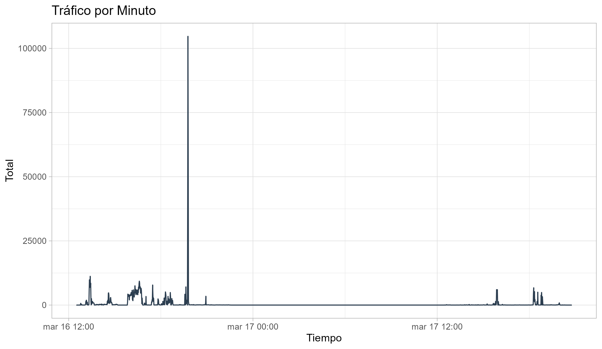
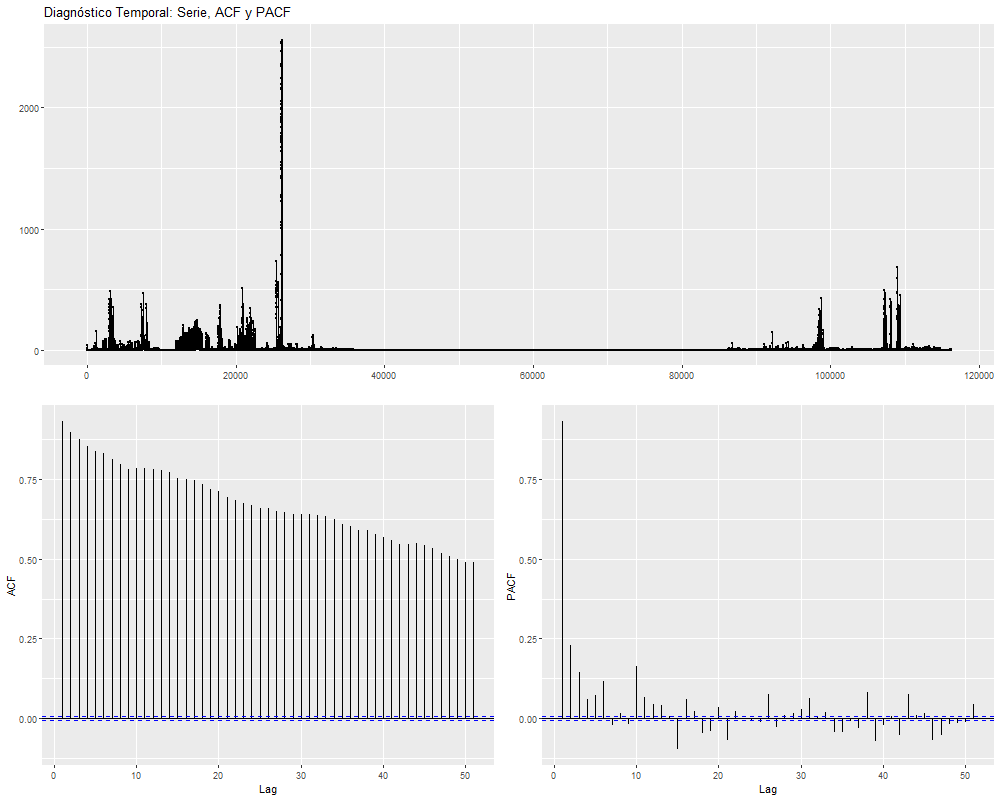
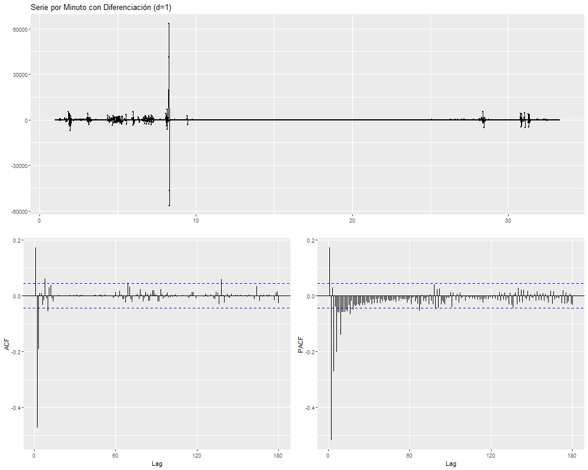
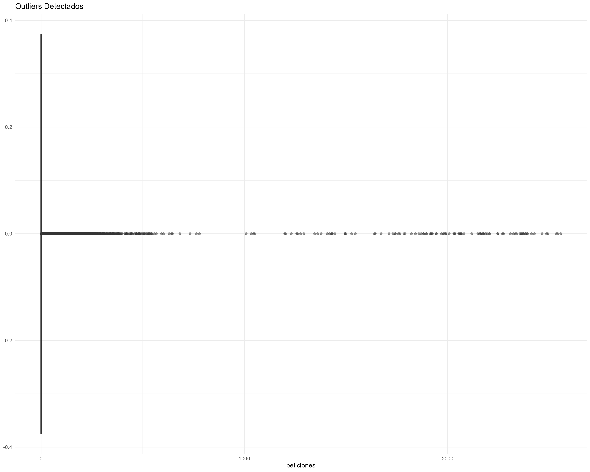
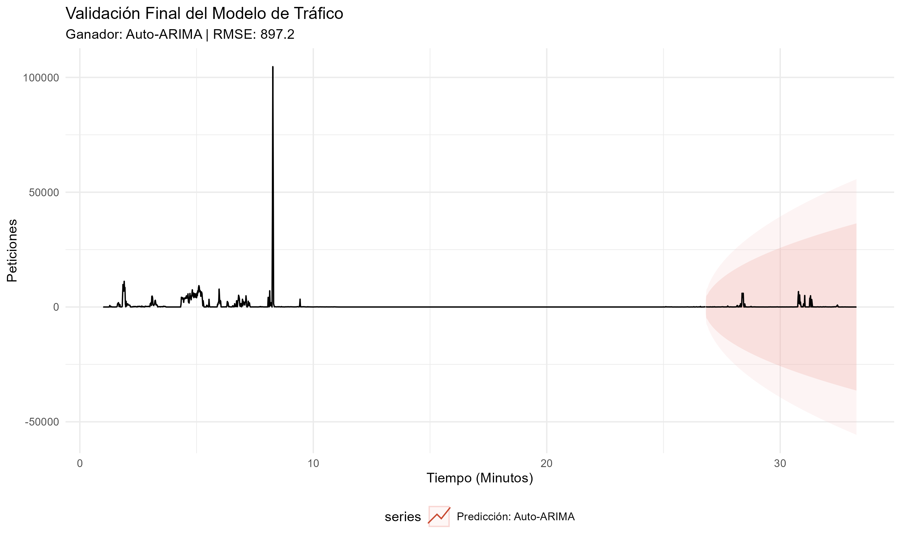
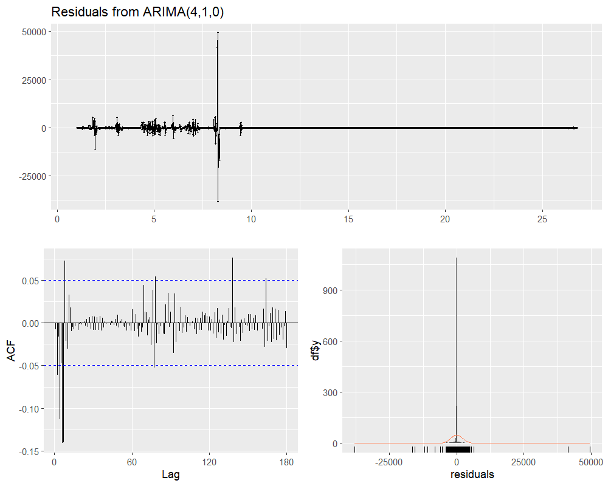

# 📈 Análisis de Series de Tiempo: Logs de Tráfico de Red

## 📖 Descripción del Dataset
El sistema procesa logs crudos de red con estructura TSV (Tab-Separated Values). Cada entrada representa un evento de conexión con la siguiente anatomía:
* **Timestamp:** Época Unix (ej. `1331904056.66`).
* **Identificadores:** `fuid`, `id_orig_h` (IP Origen), `id_resp_h` (IP Destino).
* **Metadatos:** MIME types, duraciones y hashes (MD5/SHA1).

### Tratamiento de Datos (Data Engineering)
1.  **Parsing:** Conversión de Unix Timestamp a objetos `POSIXct` en UTC.
2.  **Agregación:** Transformación de eventos discretos en series de tiempo continuas mediante conteo de peticiones por segundo, minuto y hora.
3.  **Imputación:** Uso de `complete()` para rellenar vacíos temporales con ceros, evitando sesgos en los modelos ARIMA.

## Análisis Exploratorio (EDA)

| Descripción | Visualización |
| :--- | :--- |
| **Tráfico por Segundo:** Identificación de ráfagas (burstiness). |  |
| **Tráfico por Minuto:** Base para el modelado predictivo. |  |
| **Diagnóstico ACF/PACF:** Análisis de memoria de la serie. |  |
| **Diferenciación (d=1):** Estabilización de la media. |  |
| **Outliers:** Identificación de anomalías mediante boxplots. |  |

## Modelado y Validación

Se ejecutó un torneo de modelos seleccionando al ganador bajo el criterio de **mínimo RMSE**:
1.  **Holt-Winters:** Captura tendencia sin estacionalidad.
2.  **Auto-ARIMA:** Optimización paramétrica automatizada.
3.  **SARIMA (STL):** Descomposición estacional robusta.

### Diagnóstico del Mejor Modelo
Se validó que los residuales se comporten como **Ruido Blanco** (test de Ljung-Box y normalidad de Shapiro-Wilk).

| Resultado Final | Diagnóstico de Residuales |
| :--- | :--- |
|  |  |