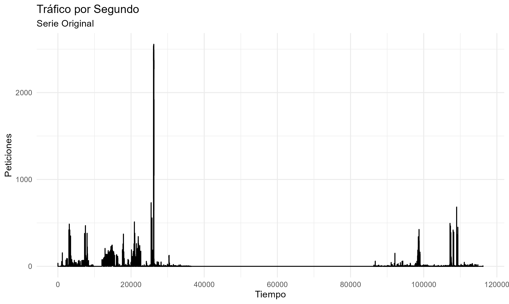
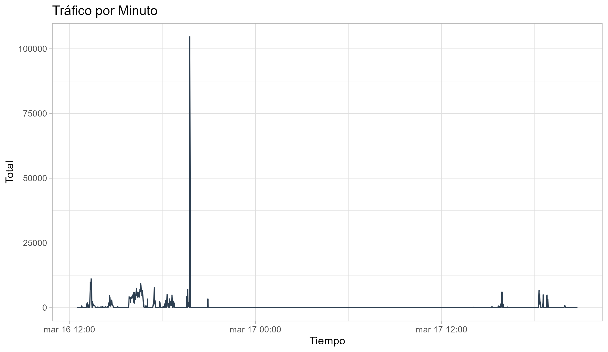
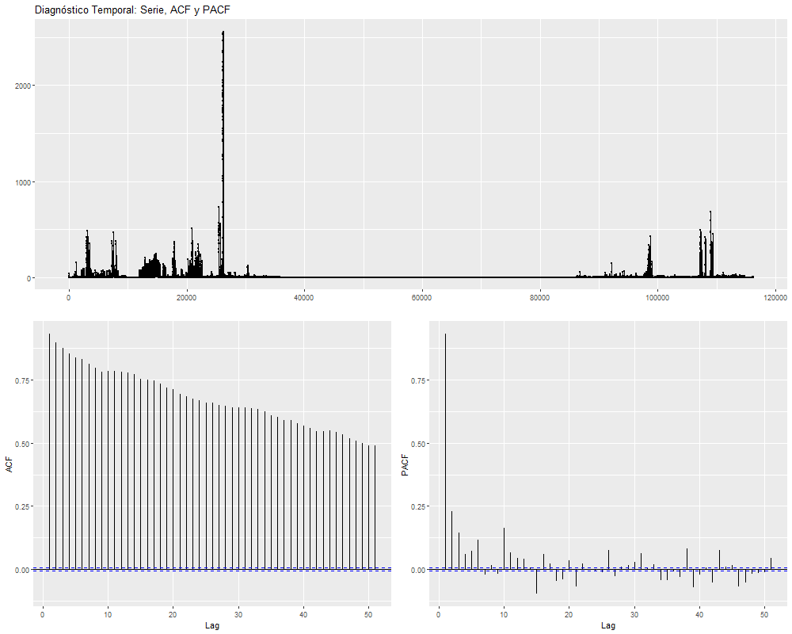
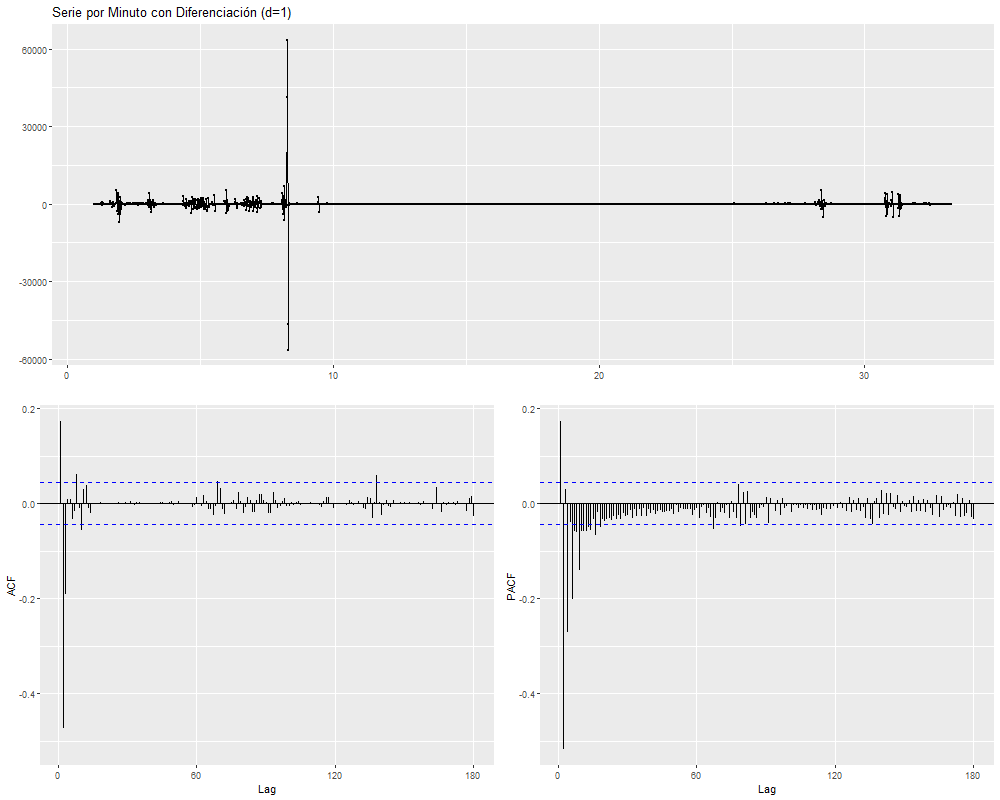
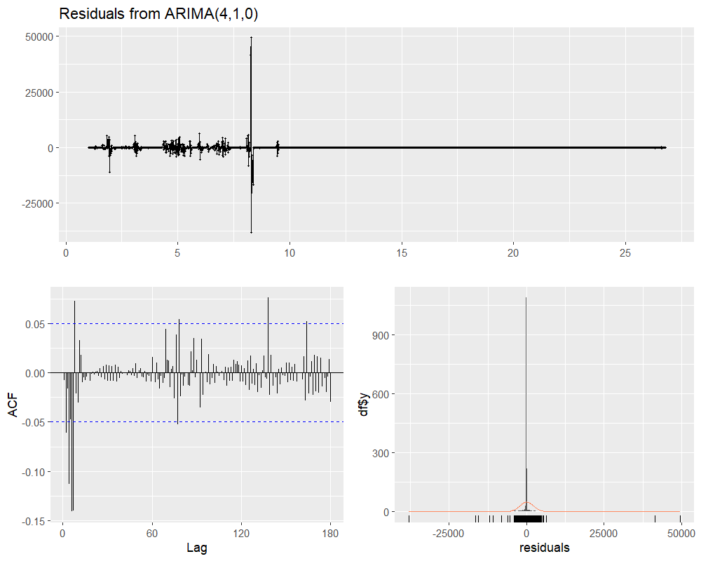

# Análisis de Series de Tiempo en Logs de Tráfico de Red

## Introducción
Este proyecto aplica modelos de pronóstico avanzados (ARIMA/VAR) sobre datos de tráfico de red para identificar patrones de comportamiento y anomalías temporales.

## Objetivos
* Modelar la volatilidad del tráfico de red por segundo.
* Validar supuestos de estacionariedad (ADF, KPSS).
* Predecir picos de carga mediante modelos de transferencia lineal.

## Metodología
1. **Pre-procesamiento**: Conversión de timestamps y limpieza de series.
2. **Modelado**: Implementación competitiva de:
   * **Holt-Winters**: Suavización exponencial con tendencia.
   * **Auto-ARIMA**: Optimización paramétrica basada en información de Akaike.
   * **SARIMA (STL)**: Manejo de estacionalidad mediante descomposición estacional.
3. **Validación**: Análisis de errores (RMSE, MAE, MAPE) y diagnóstico de ruido blanco en residuales.

## Análisis Exploratorio de Datos (EDA)

Se ha implementado un pipeline de procesamiento de logs con los siguientes componentes:

### 1. Visualización de Series Temporales
* **Multiescala:** Análisis de tráfico por segundo, minuto y hora para identificar patrones de ráfagas.
* **Suavizado (Moving Average):** Se incorporó una media móvil ($k=5$) para filtrar el ruido blanco y visualizar la tendencia subyacente.

### 2. Diagnóstico Estadístico
Se generan diagnósticos automáticos de estacionariedad en la carpeta `/output`:
* **ACF/PACF:** Evaluación de autocorrelación para la selección de órdenes en modelos ARMA/ARIMA.
* **Pruebas de Raíz Unitaria:** Resultados de los tests ADF y KPSS exportados en `test_estacionariedad.txt`.

###  Galería de Resultados
| Descripción | Visualización |
| :--- | :--- |
| **Tráfico por Segundo** |  |
| **Tráfico por Minuto** |  |
| **Análisis ACF/PACF** |  |
| **Diferenciación (d=1)** |  |
| **Diagnóstico Residuales** |  |
| **Comparativa Forecast** |  |

### Guía de ejecución
1. Asegúrese de tener instaladas las librerías: `forecast`, `ggplot2`, `magrittr`.
2. Ejecute `src/01_eda.R` para generar la serie temporal.
3. Ejecute `src/02_modelado.R` para obtener las predicciones y métricas en `/output`.